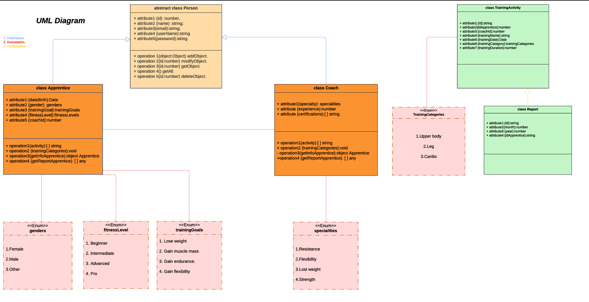
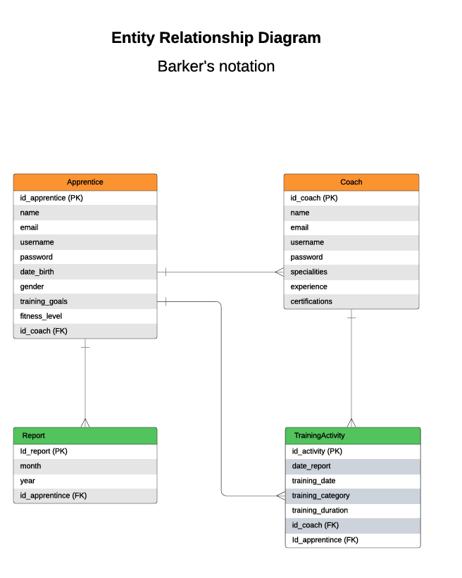

# Gym project - Main services Gym Management

## Members

- Dayana Montoya

- Dilbani Enriquez

- Germán Guerrero

- Heidy Vera

- Laura Zuluaga

### Tecnologías

El repostiorio contiene:

<ul>  
<li> En la carpeta docs, está el diagrama UML de clases.</li>  

<li>En la carpeta docs, está el diagrama entidad relación.</li>  

<li>En backups está el DDL de la base de datos.</li>  

<li>La base de datos está desplegada en Railway.</li>  

<li>La colección de Postman está en docs</li>  

<li> Usamos Railway para alojar nuestra base de datos</li>

<li> Se empleo variables de entorno con el NPM de dotenv </li>

</ul>

## Evidencia en video de la base de datos desplegada en Railway

- [Evidencia de base de datos desplegada en Railway](https://youtu.be/Ihmav33wPaM)

## Diagrmas

